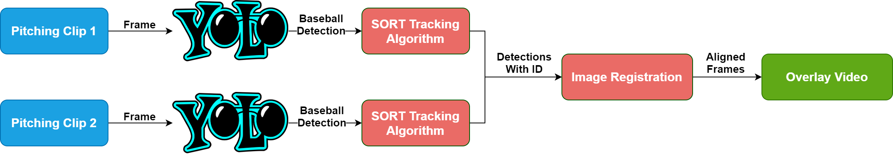

<p align=center>
    
</p>

<p align=center>
    <a target="_blank" href="https://travis-ci.com/chonyy/ML-auto-baseball-pitching-overlay" title="Build Status"></a>
    <a target="_blank" href="#" title="language count"></a>
    <a target="_blank" href="#" title="top language"></a>
    <a target="_blank" href="https://img.shields.io/github/pipenv/locked/python-version/chonyy/daily-nba" title="Python version"></a>
    <a target="_blank" href="https://opensource.org/licenses/MIT" title="License: MIT"></a>
    <a target="_blank" href="#" title="repo size"></a>
    <a target="_blank" href="http://makeapullrequest.com" title="PRs Welcome"></a>
</p>

> ⚾ Overlaying pitch motion and trajectory automatically with machine learning!

This project takes your baseball pitching clips and **automatically** generates the overlay. A fine-tuned Yolov4 model is used to get the location of the ball. Then, I implemented SORT tracking algorithm to keep track of each individual ball. Lastly, I will apply some image registration techniques to deal with slight camera shift on each clip.

I'm still trying to improve it! Feel free to follow this project, also check out the Todo list. 

The idea came from [this incredible overlay](https://www.youtube.com/watch?v=jUbAAurrnwU&ab_channel=YuTubeKs).

## 💻 Getting Started

These instructions will get you a copy of the project, and generates your own pitching overlay clip!

### Get a copy

Get a copy of this project by simply running the git clone command.

``` git
git clone https://github.com/chonyy/ML-auto-baseball-pitching-overlay.git
```

### Prerequisites

Before running the project, we have to install all the dependencies from requirements.txt

``` pip
pip install -r requirements.txt
```

### Overlay!

Last, run the project with your own clips!

#### Try a sample

``` python
python pitching_overlay.py
```

#### Try with yout own clips

Place your pitching videos in a folder, then specify the path in the CLI.

``` python
python pitching_overlay.py --videos_folder "./videos/videos"
```

## 🔨 Project Structure

<p align=center>
    
</p>

## 🎬 More Demo

<p align=center>
    
</p>

## ☑️ Todo

- [X] Implement image registration to deal with camera shift
- [ ] Build a demo web app for people to use it in realtime on web
- [ ] Improve the visual effect
- [ ] Write a Medium post to explain the technical workflow
- [ ] Draw a structure diagram
